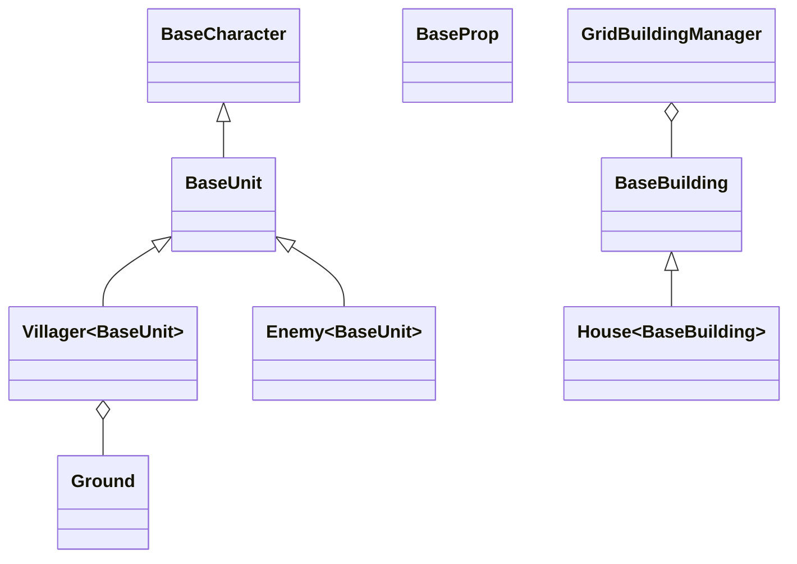

# Project Architecture Overview

This document provides a detailed overview of the project architecture, with a focus on extensibility and the workflow for adding new content or features.

---

## 1. Project Overview

This Unity project is structured for extensibility, allowing new gameplay content and features to be added efficiently. The architecture leverages inheritance, prefab variants, and modular systems to support maintainable growth.

---

## 2. Folder Structure & Organization

```
Assets/
  ├── Config/           # Configuration files and settings
  ├── Resources/        # Art, prefabs, and other resources
  ├── Scenes/           # Unity scene files
  ├── Scripts/          # Core game logic, organized by feature
  │     ├── Building/
  │     ├── Camera/
  │     ├── Player/
  │     │     └── Movement/
  │     ├── Tilemap/
  │     └── Unit/
  │           └── Villager/
  ├── Settings/         # Rendering and project settings
  └── TextMesh Pro/     # Fonts and text assets
Packages/
  └── unity-mcp/        # Custom or third-party packages
ProjectSettings/        # Unity project settings
```

- **Scripts**: Organized by feature for clarity and modularity.
- **Resources/Prefabs**: Prefab assets, including base prefabs and variants for extensibility.
- **Scenes**: Contains gameplay and test scenes.

---

## 3. Core Class Hierarchy & Extensibility

The project uses a base class hierarchy to enable extensibility:

- **BaseCharacter**: Main player character.
- **BaseUnit**: Any NPC (e.g., Enemy, Villager).
- **BaseProp**: Environmental objects.
- **BaseBuilding**: Buildings and structures.

### Inheritance for Extensibility

- New units, props, or buildings are created by subclassing the appropriate base class.
- Example: To add a new villager type, create a new script inheriting from `BaseVillager` (which itself inherits from `BaseUnit`).

---

## 4. Prefab Variant Workflow

Unity's prefab variant system is central to extensibility:

1. **Select a base prefab** (e.g., `BaseVillager`, `BaseBuilding`).
2. **Create a prefab variant** for the new content.
3. **Customize the variant** (e.g., visuals, stats, behaviors).
4. **Place the variant in the appropriate Resources/Prefabs subfolder**.

**Benefits:**
- Inherits all base properties and logic.
- Centralized updates: changes to the base prefab propagate to all variants.
- Consistent behavior and easy maintenance.

---

## 5. Key Extensible Systems

### GridBuildingManager

- Singleton manager for grid-based building placement.
- Uses Unity's Tilemap system.
- Supports new building types via prefab variants.
- Handles preview and placement logic.

### BaseVillager & State System

- `BaseVillager` implements a state machine (Idle, Walking, Sleeping, etc.).
- Uses Unity's NavMeshAgent for navigation.
- Extensible: add new villager types or behaviors by subclassing or composition.

### Ground

- Singleton utility for managing playable area boundaries.
- Used by other systems to constrain movement and placement.
- Extensible for new level layouts or dynamic boundaries.

---

## 6. Adding New Content or Features

### Adding a New Building

1. **Create a new script** inheriting from `BaseBuilding` (if custom logic is needed).
2. **Create a prefab variant** from the base building prefab.
3. **Customize the prefab** (art, properties, scripts).
4. **Add the prefab to the appropriate Resources/Prefabs/Buildings folder**.

### Adding a New Villager or NPC

1. **Create a new script** inheriting from `BaseVillager` or `BaseUnit`.
2. **Create a prefab variant** from the base villager or unit prefab.
3. **Customize the prefab** (appearance, stats, behaviors).
4. **Add the prefab to Resources/Prefabs/Units or Units/Villager**.

### Extending Behaviors

- Add new states or logic to the state machine in `BaseVillager` or its subclasses.
- Use composition (attach new MonoBehaviours) for modular features.

### Integrating New Art Assets

- Place new sprites, models, or materials in the appropriate Resources/Art subfolder.
- Reference them in prefab variants as needed.

### Best Practices

- Always use prefab variants for new content to maximize maintainability.
- Keep scripts modular and favor composition for reusable features.
- Document new scripts and prefabs for future contributors.

---

## 7. Architecture Diagram



---

## Summary

This architecture is designed for extensibility and maintainability. By leveraging inheritance, prefab variants, and modular systems, new content and features can be added with minimal friction and maximum consistency.