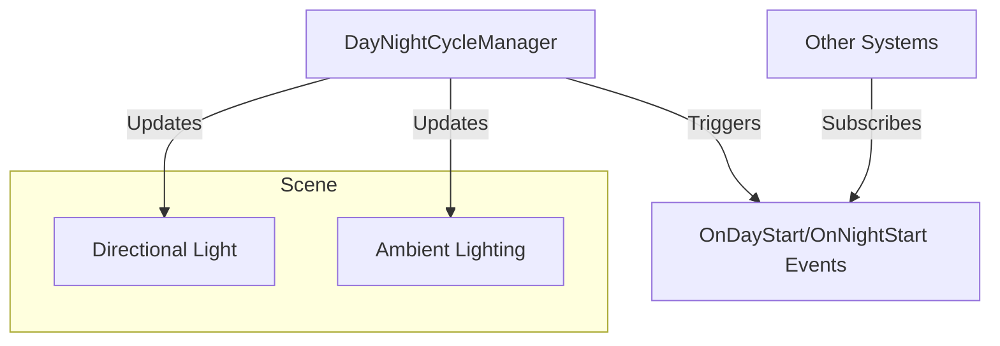

# Day-Night Cycle System: Implementation Plan

## 1. Overview

Implement a `DayNightCycleManager` MonoBehaviour that:
- Tracks the time of day (e.g., 0–24 hours, looping).
- Updates the main Directional Light’s rotation and color to simulate sun/moon movement.
- Optionally updates ambient/environment lighting for smooth transitions.
- Exposes parameters for day length, night length, colors, and light intensities.
- **Exposes UnityEvents for day/night transitions (e.g., OnDayStart, OnNightStart) so other systems can react.**

## 2. Components

### a. DayNightCycleManager (C# Script)
- **Public parameters:**
  - Day length (seconds)
  - Night length (seconds)
  - Sunlight color (day), Moonlight color (night)
  - Sun intensity (day), Moon intensity (night)
  - Ambient color (day/night)
  - Reference to main Directional Light
- **Internal state:**
  - Current time of day (float, 0–24)
  - IsDaytime (bool)
- **Methods:**
  - `UpdateTime()`: Advances time based on deltaTime and cycle length.
  - `UpdateLighting()`: Interpolates light/ambient settings based on time.
  - **UnityEvents:** OnDayStart, OnNightStart (invoked at transitions).

### b. Scene Setup
- Ensure there is a main Directional Light in the scene (tagged or referenced).
- Attach DayNightCycleManager to a GameObject (e.g., "GameManager" or "Environment").

### c. Extensibility
- Other scripts can subscribe to day/night events via Inspector or code.
- Expose parameters in the Inspector for easy tuning.

## 3. Mermaid Diagram

## 4. Implementation Steps

1. Create `DayNightCycleManager.cs` in `Assets/Scripts/Environment/`.
2. Implement time tracking and looping (e.g., 0–24 hours).
3. Reference the main Directional Light (assign in Inspector or find by tag).
4. In `Update()`, advance time and update lighting/ambient settings.
5. Interpolate Directional Light rotation (simulate sun/moon movement).
6. Interpolate color/intensity for day/night transitions.
7. Optionally, update ambient/environment lighting.
8. **Implement UnityEvents for day/night transitions.**
9. Expose all relevant parameters in the Inspector.
10. Add the script to a suitable GameObject in the main scene.

## 5. Optional Enhancements

- Support for weather effects (clouds, rain, etc.).
- Support for multiple light sources (e.g., moon, streetlights).
- Save/load current time of day for persistence.