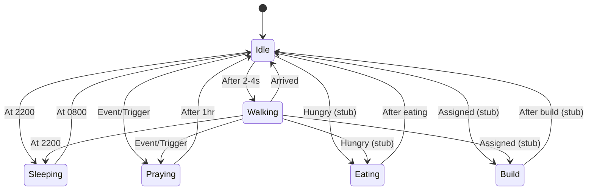

# Villager State Machine Refactor Plan

## 1. Current State Analysis

- **Current Approach:**  
  The system uses an enum-based state machine (`VillagerState`) with switch statements in both `BaseVillager` and `VillagerBehavior`.  
  Adding new states requires updating the enum and multiple switch statements, which is not scalable.

- **Limitations:**  
  - Hard to add new states (code duplication, switch bloat).
  - State logic is scattered.
  - No clear separation of concerns.

---

## 2. Proposed Architecture: State Pattern

- **Each state** (Idle, Walking, Sleeping, Build, Praying, Eating, etc.) will be a class implementing a common interface (e.g., `IVillagerState`).
- **VillagerBehavior** will hold a reference to the current state and delegate logic to it.
- **State transitions** are handled by the state classes or the main behavior class.
- **Adding new states** only requires creating a new class and registering it—no switch statement changes.

### Key Components

#### a. IVillagerState Interface

```csharp
public interface IVillagerState
{
    void Enter(VillagerBehavior villager);
    void Update(VillagerBehavior villager);
    void Exit(VillagerBehavior villager);
    string Name { get; }
}
```

#### b. Concrete State Classes

- `IdleState`, `WalkingState`, `SleepingState`, `BuildState`, `PrayingState`, `EatingState`, etc.
- Each class encapsulates its own logic and transition conditions.

#### c. VillagerBehavior

- Holds a dictionary of state instances.
- Delegates `Update`, `Enter`, `Exit` to the current state.
- Handles time-based triggers (e.g., sleeping at 2200, waking at 0800).
- Exposes a method to transition to a new state.

#### d. Extensibility

- New states can be added by creating a new class and registering it.
- Stubs for Build and Eating can be left as empty or with TODOs.

---

## 3. State Transition Examples

- **Idle → Walking:** After 2-4 seconds, pick a random direction or target.
- **Idle → Sleeping:** At 2200, transition to SleepingState.
- **Sleeping → Idle:** At 0800, wake up.
- **Idle/Walking → Praying:** At a scheduled time or event, move to shrine.
- **Idle/Walking → Eating:** When hungry (stub for now).
- **Idle/Walking → Build:** When assigned (stub for now).

---

## 4. Time-based Triggers

- Use a reference to the day/night cycle manager or a time provider.
- States can query the current time to decide transitions (e.g., SleepingState only activates at night).

---

## 5. Mermaid Diagram



---

## 6. File Structure

- `Assets/Scripts/Unit/Villager/States/IVillagerState.cs`
- `Assets/Scripts/Unit/Villager/States/IdleState.cs`
- `Assets/Scripts/Unit/Villager/States/WalkingState.cs`
- `Assets/Scripts/Unit/Villager/States/SleepingState.cs`
- `Assets/Scripts/Unit/Villager/States/BuildState.cs` (stub)
- `Assets/Scripts/Unit/Villager/States/PrayingState.cs`
- `Assets/Scripts/Unit/Villager/States/EatingState.cs` (stub)
- `Assets/Scripts/Unit/Villager/VillagerBehavior.cs` (refactored)

---

## 7. Benefits

- **Extensible:** Add new states with minimal changes.
- **Maintainable:** Each state is self-contained.
- **Testable:** States can be unit tested in isolation.
- **Future-proof:** Easy to add more complex behaviors.

---

## 8. Next Steps

- Refactor `VillagerBehavior` to use the state pattern.
- Implement Idle, Walking, Sleeping, Praying states.
- Stub Build and Eating states.
- Integrate with the day/night cycle for time-based transitions.
- Ensure the system is ready for future state additions.